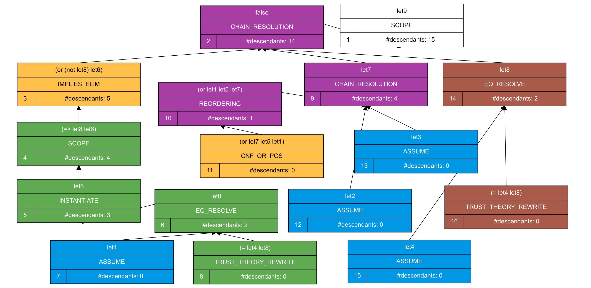

.. include:: macros.rst

.. _smt-solver-outputs:

SMT Solver Outputs
==================

As we have seen, the main result of an SMT query is either :smt:`sat` or
:smt:`unsat`.  In some cases, the solver may also output :smt:`unknown`.  This
can happen, for example, if the problem includes quantifiers.  In this section,
we discuss how to obtain more information from the solver in each case.

Satisfiable Queries
-------------------

When a solver returns :smt:`sat`, we have already seen that one possible way to
get more information is to call :smt:`get-model`, which returns values for all
of the uninterpreted constants in the formula.  A more fine-grained approach is
to call :smt:`get-value` which takes a term as an argument and returns the
value of that specific term.

Unsatisfiable Queries
---------------------

When a solver returns :smt:`unsat`, it makes a quite strong statement: there is
*no interpretation* of the user-declared symbols that satisfies the formula.
SMT solvers can provide more information as to why a formula is unsatisfiable
via an *unsat(isfiable) core*, a subset of the assertions that is already
unsatisfiable. In SMT-LIB scripts, it can be obtained with the command
:smt:`get-unsat-core`.  The unsat core is not guaranteed to be minimal, but
solvers generally make an effort to reduce its size as much as possible without
having to solve additional SMT queries.

Some solvers can also produce *proofs* for the unsatisfiability of a formula,
i.e., a structured argument showing how an inconsistency can be derived from an
unsat core of the formula. A proof can serve as a certificate of the result and
be used to independently validate the solver's response [R4]_.  A proof (if
supported) can be obtained in an SMT-LIB script with the command
:smt:`get-proof`.  The result is dependent on the proof system and format the
solver uses to represent its reasoning.  |cvcv| has full support for proofs and
unsat cores.

Consider again the Socrates example (:ref:`Example 3 <Example 3>`).  Below, we show
how to retrieve an unsat core and a proof of its unsatisfiability.

.. api-examples::
   <examples>/socrates-proof.py

The first part of the output is the unsat core.

.. code-block:: smtlib

   - (forall ((x S)) (=> (Human x) (Mortal x)))
   - (Human Socrates)
   - (not (Mortal Socrates))

The core contains all three assertions.  In this case, the core is minimal, as
all three are needed to derive :smt:`unsat`. The reasoning is shown in the
proof.  The result of the :python:`proof()` method is a proof object which
connects the input assertions to the conclusion (:smt:`unsat`) via a sequence
of steps justified by proof rules.  The proof rules used by |cvcv| are
documented on the |cvcv| website.

   A proof tree generated by |cvcv|

The above figure shows a visualization of the proof as a tree.  For readability, we
use simple names to abbreviate long terms.  Each node in the tree shows:
:math:`(i)` the formula proved (the conclusion); :math:`(ii)` the name of the
proof rule used; :math:`(iii)` a numeric id; and :math:`(iv)` the total number
of descendants.  Immediate children of each node represent premises required
for the node's proof rule.  The root node of the tree is :smt:`let9`, which
stands for :smt:`(not (and let4 let3 let2))`, where :smt:`let4`, :smt:`let3`,
and :smt:`let2` represent the three assertions.  This node has a single child
containing the conclusion :smt:`false`, based on a proof tree whose leaves are
the three assertions.  The derivation of :smt:`false` depends on instantiating
the quantified assertion (:smt:`let4`) with :smt:`x` as :smt:`Socrates`.  This
is done in node 5, but only after :smt:`(forall ((x S)) (=> (Human x) (Mortal
x)))` (i.e., :smt:`let4`) is rewritten (node 8) into :smt:`(forall ((x S)) (or
(not (Human x)) (Mortal x)))` (i.e., :smt:`let8`). The instantiation :smt:`(or
(not (Human Socrates)) (Mortal Socrates))` is named :smt:`let6`.  Node 9
concludes :smt:`(not let6)` from the other assertions. And finally, node 2
concludes :smt:`false` by combining the mutually inconsistent clauses derived
by the solver (where :smt:`let7` is :smt:`(not let6)`, :smt:`let2` is
:smt:`(not let1)`, and :smt:`let5` is :smt:`(not let3)`).

Unknown Queries
---------------

A solver returns :smt:`unknown` when it is unable to solve the input problem.
There could be several different reasons for this.  One is that the solver's
procedure may be incomplete for the class of problems the input belongs to,
which means that it is not always able to determine if the problem is
satisfiable or not.  Another possible reason is that some resource limit was
exceeded, causing the solver to stop before it could find an answer.  In
SMT-LIB, the command :smt:`(get-info :reason-unknown)` can be used to request
more information about why a solver returned :smt:`unknown`.
